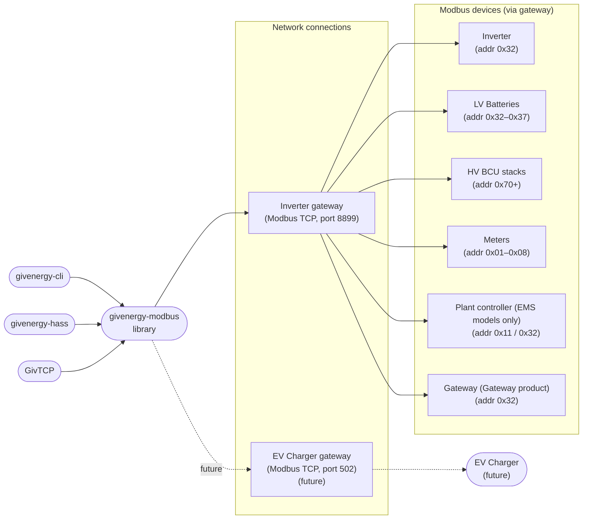
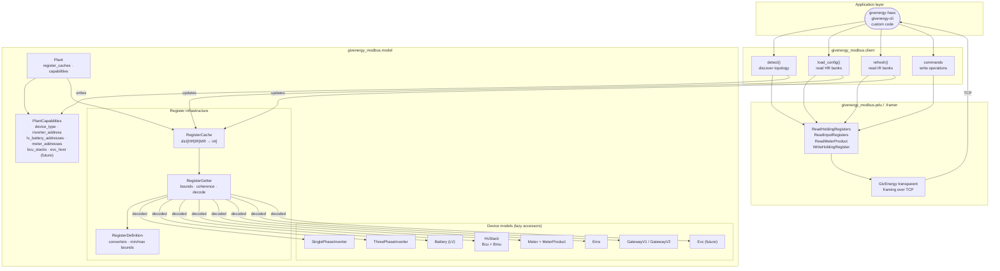
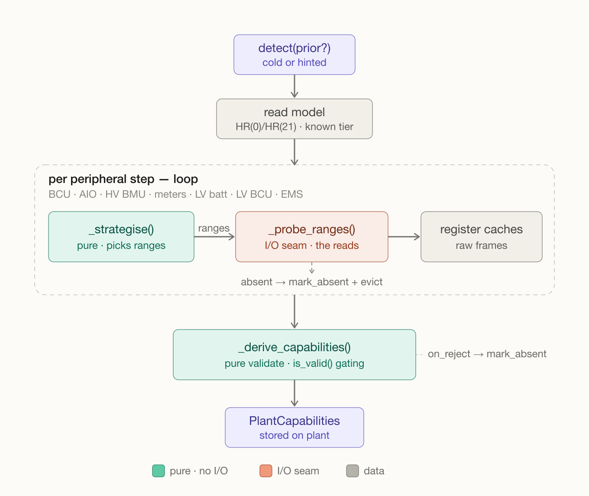
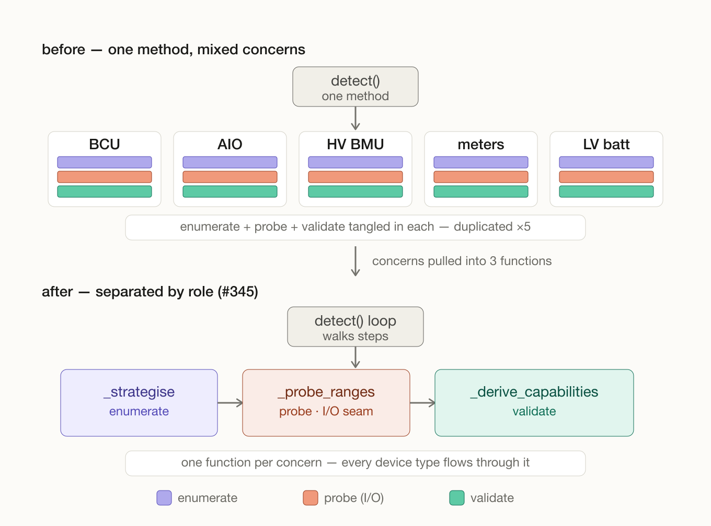

# Architecture

## Overview

`givenergy-modbus` is a layered library for communicating with GivEnergy inverters and peripherals over Modbus TCP. It handles framing, PDU encoding/decoding, register caching, and data model construction, exposing a high-level async `Client` and a `Plant` data model to application code.

## Physical topology

A GivEnergy installation exposes two network endpoints:

- **Inverter gateway** (port 8899) — the primary endpoint, using GivEnergy's proprietary transparent framing over TCP. All inverter-adjacent devices share this connection via Modbus device addresses (formerly known as slave addresses; Modbus.org adopted client/server terminology in 2020).
- **GivEVC charger** (port 502, separate IP, future) — a standard Modbus TCP device polled via a second connection.



All devices except the EVC share a single TCP connection to the gateway. The EVC requires a second connection to a different host.

## Software layers



## Client lifecycle

```
client.connect()       establish TCP connection(s)
       │
client.detect()        read HR(0)/HR(21) to resolve model; probe peripherals
       │               → writes PlantCapabilities to plant.capabilities
       │
client.load_config()   fetch HR configuration banks (slots, targets, limits)
       │               extra banks dispatched per device type (three-phase,
       │               extended slots, EMS)
       │
       ╔══ polling loop ══════════════════════════════════════╗
       ║  client.refresh()   fast poll: IR measurement banks  ║
       ║                     extra banks per device type      ║
       ╚══════════════════════════════════════════════════════╝
       │
client.load_config()   re-read after any write to confirm the change landed
```

`detect()` is intentionally slow — a correct topology is more important than fast startup. It uses a two-tier timeout: full retries for known devices, short probe retries for speculative addresses (meters, batteries, BCU stacks) where absence is the common case.

### Inside `detect()`: strategise / probe / derive

After resolving the model, `detect()` runs a loop over the peripheral steps (BCU, AIO, HV BMU, meters, LV batteries, LV BCU, EMS). Each step is split into three roles, separated by whether they touch the wire:



- **`_strategise(caps, prior, step)`** — pure policy. Given the model and an optional `prior` hint, it returns the `ProbeRange`s to read for that step. Cold (no hint) yields a broad candidate sweep; hinted restricts to the addresses `prior` already knows. No I/O, so it is exhaustively unit-testable.
- **`_probe_ranges(ranges)`** — the single I/O seam. It issues each read at its tier (fast `probe_timeout` for speculative probes, full `timeout` for known devices) and, on a probe that does not answer, calls `mark_absent()` and evicts the stale cache entry.
- **`_derive_capabilities(caches, prior, on_reject)`** — pure validation. It reads the now-populated register caches, applies each device's `is_valid()` gate, and builds the authoritative `PlantCapabilities`. Rejections thread back through `on_reject` to `mark_absent()`.

This split is what makes the offline `Plant.from_caches()` path possible (#268): `_derive_capabilities` is the same pure function whether the caches came from a live probe or a saved register dump.

!!! note
    Two steps stay imperative rather than routing through `_strategise`: the initial model read, and LV-battery enumeration (which carries the cold-start splice-guard re-probe, #233/#289). The loop above shows the dominant pattern, not every step literally.

#### Why three functions

Before #345, `detect()` fanned out to a per-device-type helper for each peripheral, and every helper independently tangled all three concerns — pick candidates, probe, then validate-and-mutate `caps`:



The refactor transposes that grid: instead of five helpers each doing all three jobs, there is one function per job, each spanning every device type. Candidate generation lives once (shared by `_strategise` and `_derive_capabilities`), all I/O lives in one seam, and validation lives in one place — so a change to, say, the absent-marking policy is a one-line edit rather than a five-site sweep.

## Plant data model

`Plant` is passive — it stores data, drives no I/O. Its two responsibilities are:

1. **`register_caches`** — `dict[int, RegisterCache]` keyed by Modbus device address, populated by `Client` as responses arrive.
2. **`capabilities`** — a `PlantCapabilities` dataclass describing the topology discovered by `Client.detect()`.

All plant properties are lazy decoders: they read from `register_caches` and construct the appropriate concrete model class, dispatching on `capabilities.device_type` where needed.

| Accessor | Returns | Condition |
|---|---|---|
| `plant.inverter` | `SinglePhaseInverter \| ThreePhaseInverter` | always |
| `plant.batteries` | `list[Battery]` | LV systems only |
| `plant.hv_stacks` | `list[HvStack]` | HV systems only |
| `plant.meters` | `dict[int, Meter]` | when meters detected |
| `plant.ems` | `Ems \| None` | `Model.EMS` / `EMS_COMMERCIAL` only |
| `plant.gateway` | `GatewayV1 \| GatewayV2 \| None` | `Model.GATEWAY` only |
| `plant.evc` | `Evc \| None` | future |

## Register infrastructure

Each device model is backed by a `RegisterGetter` subclass that holds a `REGISTER_LUT` — a dict mapping field names to `RegisterDefinition` instances. Each definition specifies:

- **Converter(s)** — how to decode raw `uint16` register values (e.g. `C.deci` divides by 10, `C.timeslot` reconstructs a `TimeSlot`, `C.bitfield` extracts bit ranges).
- **Post-converter** — optional second-stage transform or enum lookup.
- **Register address(es)** — one or more `HR`/`IR`/`MR` addresses; multi-register fields (e.g. `uint32`, strings) list all constituent registers.
- **Bounds** — optional `min`/`max` in real-world units (post-conversion), used to detect physically impossible values and log violations before committing a bank.

`RegisterCache` is a plain `defaultdict[HR|IR|MR, int]` — just storage. Coherence (serial-number validity) and bounds validation live on the `RegisterGetter`, applied by `Plant._commit_bank` as each bank arrives. Several classes of bad bank are already **rejected** outright: an invalid serial, a CRC failure, an all-zero dropout of a previously-populated bank, and a battery sub-bus splice. Bounds violations are the remaining exception — they're logged (at DEBUG) and the bank is still committed, pending the enforcement step tracked by a `TODO` in `_commit_bank`.

## References

### Protocol layering

The TCP surface this library talks to is two layers above the actual battery: `library → TCP → dongle → internal serial → inverter → RS485 → BMS`. The inverter caches BMS state and re-exposes it via the dongle's TCP server. This matters when interpreting failure modes — a "stuck" battery on TCP usually means a stale inverter-side cache, not necessarily a wedged BMS. See `givenergy_modbus/framer.py`'s module docstring for the wire-format details and the cache-freeze / exception-origin caveats.

### External

- **[open-giv/bms-analysis](https://github.com/open-giv/bms-analysis)** — authoritative reference for the RS485 BMS↔inverter dialect, including:
    - The "absent device" response pattern that this library's `Client.detect()` relies on for LV battery probing (zero-filled responses for unpopulated `0x32..0x37` slots, plus the `0xF556 = -273.0 °C` temperature sentinel that our `Battery` bounds incidentally reject).
    - Static analysis of the BMS firmware confirming that the BMS Modbus dispatcher only implements FC=03/04/06; max register count per request is 128; CRC failures are silently dropped without an exception response.
    - Capture tooling (`tools/serial_hexdump_logger.c`, `tools/parse_log.py`) useful for paired RS485+TCP investigations of the sort discussed in [#78](https://github.com/dewet22/givenergy-modbus/issues/78).
- **[Modbus.org spec](https://modbus.org/specs.php)** — the underlying wire protocol; GivEnergy's framing extends it with the `0x59590001` magic header and the Transparent (`0x02`) function-code envelope.
