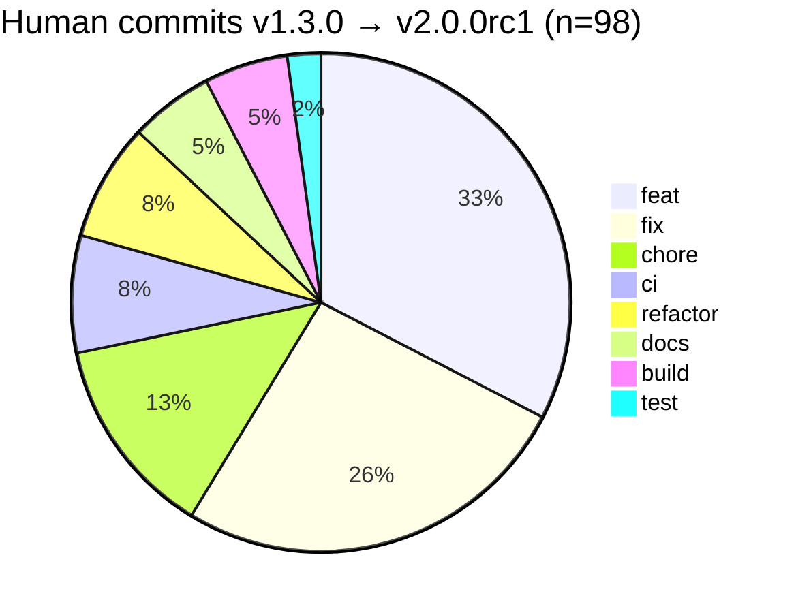

# givenergy-modbus v2.0 — ecosystem release notes

| 3 years | 10 days | +9 | 636 |
|:--:|:--:|:--:|:--:|
| of dormancy | of integration | new device models | registers mapped |

This library went quiet for several years. In that gap, [@britkat1980](https://github.com/britkat1980) carried a fork inside [GivTCP](https://github.com/britkat1980/giv_tcp) and pushed it forward against a growing range of GivEnergy kit — three-phase inverters, the All-In-One, HV battery stacks, EMS controllers, gateway and meter devices — that the original 1.x line had never seen.

v2.0 is the reunion. The protocol, model and client work that britkat developed in the fork has been integrated into a maintained main line, alongside the architectural and tooling changes that were needed to make this sustainable rather than just up-to-date. It isn't a clean-slate rewrite — much of the device-modelling reflects what the fork already learned — but it is a deliberate consolidation, with the parts that were inherited on faith now tagged for empirical verification rather than just trusted forever.

What follows is the ecosystem picture: what changed in `givenergy-modbus` itself, what's flowing through to `givenergy-cli` and `givenergy-hass`, and what to expect when migrating from 1.x.

## What's new

### Multi-model device support

Single-phase, three-phase, EMS, HV BCU/BMU, meters, and gateways now each have their own pydantic v2 data model. Plant assembles them through capability-aware dispatch (`select_inverter`, `select_gateway`) rather than assuming a single inverter topology. `ThreePhaseInverter` lives alongside `SinglePhaseInverter`; HV stacks are modelled as `Bcu` + `Bmu` composing into `HvStack`; external meter identification arrives via `MeterProduct` on its own MR register namespace.

### Device discovery

A new `Client.detect()` probes the bus for the topology, builds `PlantCapabilities`, and persists it so the next session doesn't re-discover from scratch. `Client.load_config()` and `Client.refresh()` then route per-device-kind rather than blasting a single inverter-shaped poll at whatever responds. This is the foundation that lets a mixed topology — e.g. a three-phase inverter with HV stacks and an external meter — be polled correctly without the caller hand-rolling a request list.

### Model-aware command surface

A new `_InverterCommands` mixin is composed onto the inverter model classes, so commands can be called on the instance directly:

```python
await client.one_shot_command(inverter.set_charge_target(80))
await client.one_shot_command(inverter.set_charge_slot(1, my_timeslot))
```

The mixin reads `self.slot_map` so slot setters route to the correct register pair for the model without callers having to thread it through. The underlying `commands.*` primitive layer stays public and supported — the mixin delegates to it — so lower-level integrations don't lose access. The lean v2.0 mixin covers ~25 universally-applicable commands plus 12 slot setters; model-specific mixins (three-phase, EMS, pause-mode) follow in 2.x once two register-categorisation ambiguities flagged on [#75](https://github.com/dewet22/givenergy-modbus/issues/75) are resolved against captured wire data.

### Naming and structure clean-up

- `slave_address` → `device_address` throughout the protocol and model layers, matching the Modbus.org 2020 terminology change. The old kwargs still work and emit `DeprecationWarning`.
- Battery-energy alt-source fields renamed from `_2` / `total2` to `_alt`. The `_2` suffix had been reading as "battery 2" in downstream consumers — see [givenergy-hass#32](https://github.com/dewet22/givenergy-hass/issues/32) for the original report. The companion v2.1 work ([#76](https://github.com/dewet22/givenergy-modbus/issues/76)) will add computed-property facades that pick across the source registers, deferred until real wire data is available from a few inverters across firmware versions.
- All model classes now ride on pydantic v2.

### Reliability

A handful of concurrency and resilience fixes have landed: connection-cleanup correctly tears down stale reader/writer/tasks before a reconnect (covering unexpected EOF), a late-arrival wire-skip optimisation prevents duplicated frames when probes retry at zero delay, and the bounds-checker's all-zero-bank carve-out stops absent-meter slots flooding the logs each poll. The producer/consumer task pair has had a number of small hardening passes.

### Diagnostics

`Client.capture_frames(sink, duration=60.0)` tees a redacted copy of each TX/RX wire frame to a caller-supplied callback while the normal refresh loop continues. The library guarantees redaction before invoking the sink — serial numbers come through with their prefix letters intact (those carry hardware-family signal: Gen 2 vs Gen 3 vs AIO; dongle vs inverter) and only the digits zeroed. Same byte length, same offsets, so frame-level CRCs stay consistent for offline parsing tools. This unblocks empirical-evidence-led decisions for the v2.1 design questions noted above.

### Python and tooling

- Floor moved to Python 3.14, tracking where Home Assistant Core itself has gone (HA 2026.5.2 and main both require 3.14.2+).
- Release machinery rebuilt: per-push changelog bot replaced with release-time generation from conventional-commit history, PyPI publishing on OIDC (no API tokens), a `republish_tag` mode for re-shipping an existing tag without bumping, and prerelease stage transitions (a → b → rc) in the bump tooling so an RC can actually be cut from an alpha line.
- Workflow files audited for command-injection patterns and downstream consumers' `requires-python` floors documented as needing to move in lockstep when this project drops a Python version — that bit caught me out during the rc1 release, so it's in [CONTRIBUTING.md](https://github.com/dewet22/givenergy-modbus/blob/main/CONTRIBUTING.md) now.

## By the numbers

The shape of this delta tells the phoenix story almost more clearly than the prose.

### The quiet years

```text
 v0.10.1     v0.99.0    v1.0.0-dev.0                              v1.0.0 → v2.0.0rc1
  2022-03 ── 2023-04 ── 2023-04 ─────────────────────────────── 2026-05 ─── 2026-05
               │                  3 years 1 month of silence                  ▲
               └─ false start                                       10 days of integration
```

The 1,121-day gap between `v1.0.0-dev.0` and `v1.0.0` is the actual dormancy; the 404 days between `v0.10.1` and `v0.99.0` was a false start. The 10-day burst at the end is what you're looking at when you read v2.0 — but most of the work it absorbs was happening in the GivTCP fork the whole way through.

### Surface growth, `v1.3.0` → `v2.0.0rc1`

| | v1.3.0 | v2.0.0rc1 | Δ |
|---|---:|---:|---:|
| Pydantic device models | 1 | 10 | **+9** |
| Tracked registers across all models | 191 | 636 | **3.3×** |
| Write-safe register set | 26 | 74 | **2.8×** |
| Public `commands.*` functions | 29 | 52 | +23 |
| `Client.*` public async methods | 6 | 10 | +4 |
| Test functions | 84 | 348 | **4.1×** |
| Library LOC (`givenergy_modbus/`) | 2,766 | 5,743 | +2,977 |
| Model layer LOC (`model/`) | 989 | 3,080 | **3.1×** |

The "1 → 10 pydantic models" line is the technical version of the phoenix story: a single monolithic `Inverter` class became a family — `SinglePhaseInverter`, `ThreePhaseInverter`, `Bcu`, `Bmu`, `Battery`, `Ems`, `GatewayV1`, `GatewayV2`, `Meter`, `MeterProduct` — each modelling a distinct piece of hardware that the original library never saw but the fork did.

### Registers tracked per device model

```text
SinglePhaseInverter  ████████████████████████████  192
ThreePhaseInverter   ███████████████████████████   186
Ems                  ███████████                    75
GatewayV1/V2         ███████████                    75
Battery              ██████                         44
Meter                █████                          36
Bcu                  ████                           28
```

The single-phase count barely moved (191 → 192); the rest of the growth came from device classes that didn't exist as separate models before v2.0.

### The 10-day burst

124 commits between `v1.3.0` and `v2.0.0rc1`. Of those, 98 are human-authored; the other 26 are release-tagging and per-push housekeeping (most of which were retired mid-burst when changelog generation moved to release time).



```text
43 files changed, 6,788 insertions(+), 352 deletions(-)
20 new files, 0 deletions
3 breaking changes (refactor!, fix!, build!)
```

A 19:1 insertions-to-deletions ratio is the integration shape: this release absorbs surface rather than replacing it. The three `!` commits are the rename of `_2`/`total2` battery-energy fields, the slot-map-required-arg change, and the Python 3.13 drop. Everything else is additive.

## Across the ecosystem

v2.0 isn't only a library change. The two consumers in this ecosystem are bringing parallel updates.

### givenergy-cli

[`givenergy-cli`](https://github.com/dewet22/givenergy-cli) gains a new `debug capture-frames` command (tracked in [givenergy-cli#4](https://github.com/dewet22/givenergy-cli/issues/4)) that wraps `Client.capture_frames` for end users who aren't writing Python. Once the library bump lands ([givenergy-cli#5](https://github.com/dewet22/givenergy-cli/pull/5)), the CLI gives anyone investigating a bug a one-line way to attach an inverter capture to a GitHub issue — safely redacted by the library, no separate sanitisation step required.

### givenergy-hass

[`givenergy-hass`](https://github.com/dewet22/givenergy-hass) is cutting [its own v1.0 release](https://github.com/dewet22/givenergy-hass/pull/41) alongside the library — the first stable release of a native HA integration for GivEnergy hardware that requires no external components. The previous path into Home Assistant ran through [GivTCP](https://github.com/britkat1980/giv_tcp): a Docker add-on that polls the inverter over Modbus and surfaces entities via MQTT. GivTCP is thorough and battle-tested, and the device-model work it accumulated in the gap is a large part of the foundation v2.0 builds on — but it is an additional moving part, with its own scheduler, MQTT bridge, and configuration surface sitting between the inverter and HA. `givenergy-hass` cuts that path: Modbus TCP directly from HA to the inverter, a standard config flow, and native entities with no dependencies beyond the integration itself.

v1.0 is the first release where that's been coherently packaged. The codebase was carrying several years of incremental fixes without a clear story; v1.0 gives it one.

| 44 | 4 | 110 | +18 |
|:--:|:--:|:--:|:--:|
| commits | new services | HA entities | new entities |

**Dashboard generator.** A new `givenergy_local.generate_dashboard` service builds a full, topology-aware Lovelace dashboard for the discovered inverter and battery configuration, writes the YAML to `/local/`, and surfaces a download link via persistent notification. The dashboard is versioned: when a new schema ships, the integration raises a fixable HA Repairs issue so users can regenerate with one click and have their settings preserved.

**Wire-frame capture.** `givenergy_local.capture_frames` wraps `Client.capture_frames()` directly from HA Developer Tools or an automation — same redaction guarantees as the CLI tool, so the resulting file is safe to attach to a GitHub issue without stripping serial numbers manually ([hass#45](https://github.com/dewet22/givenergy-hass/issues/45)).

**Config surface simplified.** The `retries` and `timeout_tolerance` config-flow knobs are removed; both invited tuning that extended downtime rather than shortened it, and the library now ships calibrated defaults. `async_migrate_entry` strips the fields from existing entries on first load. A reconfigure flow was added so connection settings can be changed without removing and re-adding the integration.

**Battery pause is now writable.** `battery_pause_mode` moves from a read-only sensor to a `select` (Disabled / Pause Charge / Pause Discharge / Pause Both), with a pair of time entities for the pause slot.

**Alt battery energy sensors corrected.** The `e_battery_*_2` sensors — previously misread as "Battery 2" but actually an alternate register bank on certain single-phase models — are renamed to `e_battery_*_alt` to match the library rename, and suppressed on models that don't populate that register bank. Closes the long-standing "Battery 2 with no Battery 1" confusion ([hass#32](https://github.com/dewet22/givenergy-hass/issues/32), [hass#44](https://github.com/dewet22/givenergy-hass/issues/44)).

**Reliability.** Coordinator reset semantics corrected (resets on the Nth consecutive failure, matching what `timeout_tolerance=N` implies); default dropped from 5 to 3. Slot edits write a single endpoint rather than round-tripping a stale read on the other end. Close/reconnect log lines now appear under the integration's own logger.

**Inverter-bound command API migration** ([hass#43](https://github.com/dewet22/givenergy-hass/issues/43)) is deferred to v1.1 — `commands.*` carries no deprecation in 2.x, and the migration is cleaner once the model-specific mixins from givenergy-modbus#75 land.

The HV battery stack support that britkat carried in the fork — `Bcu` / `Bmu` / `HvStack` — surfaces in HA naturally through the v2.0 device-discovery path; no extra integration work was needed beyond the library bump.

#### Migrating from v0.x

Entity IDs that change or move platform:

| Was | Is | Note |
|---|---|---|
| `sensor…battery_pause_mode` | `select…battery_pause_mode` | Now writable |
| `sensor…e_battery_charge_2` | `sensor…e_battery_charge_alt` | Library rename; absent on models that don't populate it |
| `sensor…e_battery_discharge_2` | `sensor…e_battery_discharge_alt` | " |
| `sensor…e_battery_charge_day_2` | `sensor…e_battery_charge_day_alt` | " |
| `sensor…e_battery_discharge_day_2` | `sensor…e_battery_discharge_day_alt` | " |

`…` is `givenergy_inverter_<serial>_`. Orphaned entries from the old IDs can be removed via **Settings → Devices & Services → GivEnergy Local → the inverter device → "+ N entities not shown"**.

Config entries are migrated automatically on first load: `retries` and `timeout_tolerance` are stripped and the integration runs on the library's calibrated defaults. No user action needed.

## Migrating from v1.x

### Imports and classes

The single-class inverter model has split. If you wrote against v1.x:

- `Inverter` → `SinglePhaseInverter`. A module-level `Inverter` alias still exists and emits `DeprecationWarning`; prefer `Plant.inverter`, which returns the correct concrete type for the discovered hardware (`SinglePhaseInverter | ThreePhaseInverter`).
- `InverterRegisterGetter` → `SinglePhaseInverterRegisterGetter`. Same shape, just renamed.
- New models you may need to be aware of when handling mixed topologies: `ThreePhaseInverter`, `Bcu`, `Bmu`, `HvStack`, `Meter`, `MeterProduct`, `Ems`, `GatewayV1`, `GatewayV2`.

### Command call style

The recommended pattern is now:

```python
# Before (v1.x):
await client.one_shot_command(commands.set_charge_slot(1, my_timeslot))
await client.one_shot_command(commands.set_charge_target(80))

# After (v2.0):
inverter = plant.inverter
await client.one_shot_command(inverter.set_charge_slot(1, my_timeslot))
await client.one_shot_command(inverter.set_charge_target(80))
```

`commands.*` remains supported as the primitive layer the mixin delegates to. There's no deprecation planned within 2.x — see the [stability note in usage.md](../usage.md#stability).

### Field renames

| Was | Is |
|---|---|
| `e_battery_discharge_2` | `e_battery_discharge_alt` |
| `e_battery_charge_2` | `e_battery_charge_alt` |
| `e_battery_discharge_day_2` | `e_battery_discharge_day_alt` |
| `e_battery_charge_day_2` | `e_battery_charge_day_alt` |
| `e_battery_discharge_total2` | `e_battery_discharge_total_alt` |
| `e_battery_charge_total2` | `e_battery_charge_total_alt` |

The unsuffixed `e_battery_charge_day` / `e_battery_discharge_day` are unchanged. The unified `e_battery_charge_total` / `e_battery_discharge_total` computed properties land in v2.1.

### Behavioural changes

- `slot_map` is now a required positional argument on `commands.set_*_slot*` primitives (it used to default to `EXTENDED_SLOTS`, which silently mis-routed on single-phase inverters with only 2 slots). The inverter-bound API removes the need to pass it at all.
- `Client.detect()` is now part of the connection lifecycle if you want capability-aware refresh. Existing code that called `connect()` + `refresh_plant()` continues to work but won't get the device-specific routing.

### Python floor

Python 3.14+. If you pin `givenergy-modbus` on a long-lived release branch, drop your `requires-python` to match — uv will otherwise fail the next lock refresh with a Python-version split.

## What's coming next

v2.1 is the home for things that depend on real wire data rather than inherited assumptions:

- The computed-property facade unifying the battery-energy `_alt` sources behind canonical `e_battery_charge_total` / `e_battery_discharge_total` attributes ([#76](https://github.com/dewet22/givenergy-modbus/issues/76) v2.1 piece). Blocked on capture data from a few inverters across firmware versions via [#66](https://github.com/dewet22/givenergy-modbus/issues/66).
- Model-specific command mixins for three-phase, EMS, and pause-mode on top of the v2.0 scaffolding ([#75](https://github.com/dewet22/givenergy-modbus/issues/75) v2.1 piece). Pending verification of the register-categorisation ambiguities flagged on the issue.
- Re-applying the model-layer correctness fixes from [#74](https://github.com/dewet22/givenergy-modbus/issues/74) that were deferred to keep v2.0 scope tight.
- Bounds-enforcement flip ([#57](https://github.com/dewet22/givenergy-modbus/issues/57)) and field-validation of the inherited register mappings ([#48](https://github.com/dewet22/givenergy-modbus/issues/48)).

The shape of those is mostly settled; what's not is the empirical signal that should drive the implementation choices. v2.0 establishes the surface that lets that data come in — through the capture tool, through downstream consumers using the new attributes, through actual deployments on mixed topologies.

### givenergy-hass v1.1

Two items deferred from v1.0 land here, both gated on givenergy-modbus v2.1:

- **Inverter-bound command API** ([hass#43](https://github.com/dewet22/givenergy-hass/issues/43)): migrate the ~15 `commands.*` call sites across the platform modules to the `inverter.*` instance methods, removing the need to pass `slot_map` at call sites. Gated on the model-specific mixins from [givenergy-modbus#75](https://github.com/dewet22/givenergy-modbus/issues/75).
- **Unified battery energy sensors**: once the computed-property facade from [givenergy-modbus#76](https://github.com/dewet22/givenergy-modbus/issues/76) lands, the `_alt` sensor variants can be retired in favour of canonical `e_battery_charge_total` / `e_battery_discharge_total` attributes that pick correctly across register banks regardless of model.

If you ran on v1.x, thanks for sticking around. If you ran on the GivTCP fork in the gap, the work you did with it is the reason v2.0 has the shape it does — particularly the device coverage and the model boundaries.
